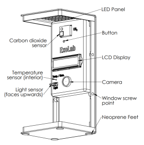

# "This series of images was taken on the ISS in the space TANGO incubator as part of the Exolab11 mission.

---
This series of images was taken on the International Space Station (ISS) in the TANGO incubator as part of the ExoLab-11 mission[^1][^6]. The images show a single Medicago truncatula plant growing in microgravity conditions aboard the ISS[^6].

The plant is illuminated with white LED lights in a day-night cycle, simulating Earth-like growing conditions[^6]. This lighting system is part of the compact ExoLab device, which measures 10 x 10 x 22 cm and contains various sensors to capture, record, and report data, including images[^5].

An AstroBotany calibration sticker is affixed to the wall behind the sample. 
https://astrobotany.com/product/airi-bio-imaging-spectrum-5cm/

This sticker serves two important purposes:

1. It provides color references to ensure accurate color representation in the images.
2. It includes computer vision markers to assist with automated image analysis[^6].

The ExoLab-11 mission, scheduled for launch in September 2024 aboard SpaceX-31 cargo resupply, aims to study the model legume Medicago truncatula in microgravity[^1][^6]. This research will provide valuable insights into legume biology, symbiotic nitrogen fixation, and plant genetics in space conditions[^6]. The experiment is designed to investigate how the microgravity environment alters plant physiology, which is crucial for understanding plant growth in space and developing bioregenerative life support systems for future space missions[^5].

⁂

[^1]: https://magnitude.io

[^2]: https://egrove.olemiss.edu/cgi/viewcontent.cgi?article=1380\&context=etd

[^3]: https://sciendo.com/article/10.2478/gsr-2014-0015

[^4]: https://www.seton.com/labels-decals/inventory-inspection/calibration.html

[^5]: https://magnitude.io/exolab-10/

[^6]: https://magnitude.io/exolab/

[^7]: https://www.frontiersin.org/journals/astronomy-and-space-sciences/articles/10.3389/fspas.2016.00003/full

[^8]: https://ntrs.nasa.gov/api/citations/20120010667/downloads/20120010667.pdf

[^9]: https://www.labelvalue.com/calibration-label-2-x-1-rectangle.html

[^10]: https://issnationallab.org/upward/space-tango-research-in-a-box/

[^11]: https://magnitude.io/product/exolab-11-program-license/

[^12]: https://ntrs.nasa.gov/api/citations/20110016176/downloads/20110016176.pdf

